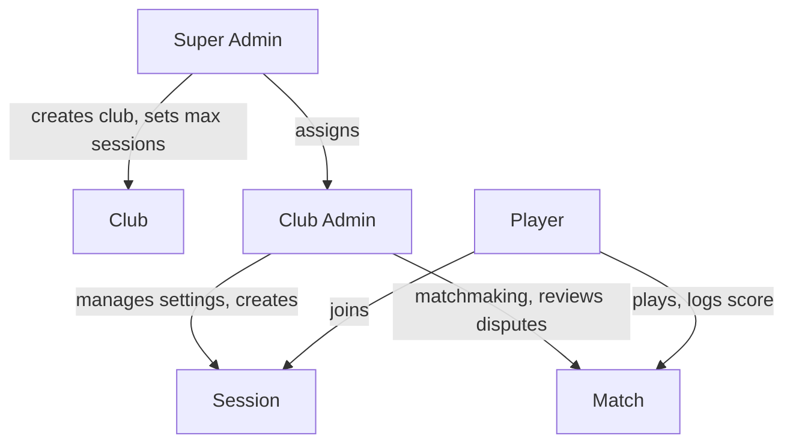
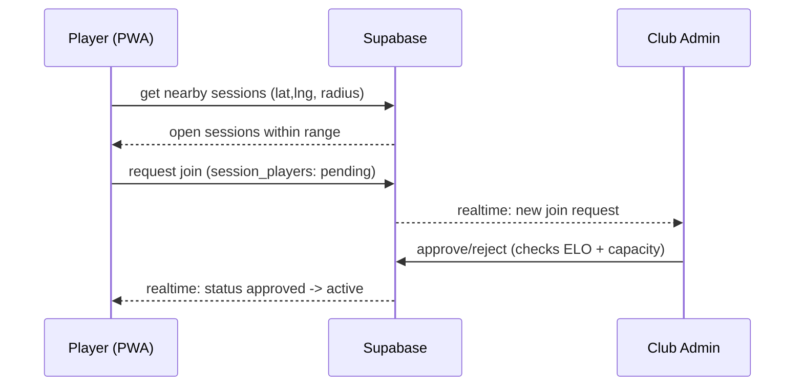
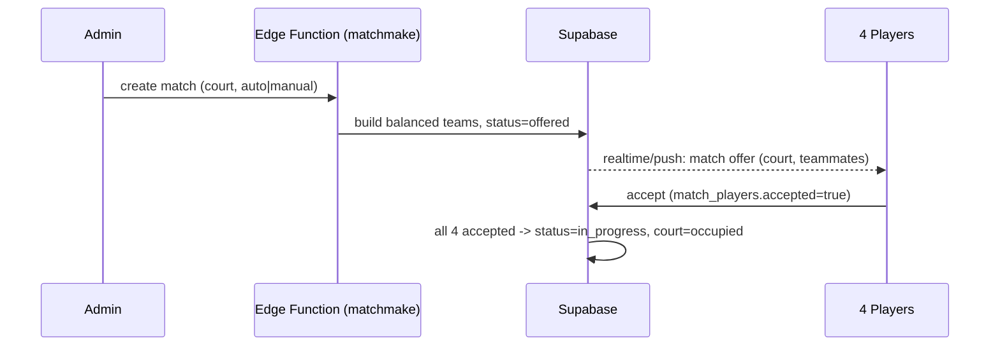
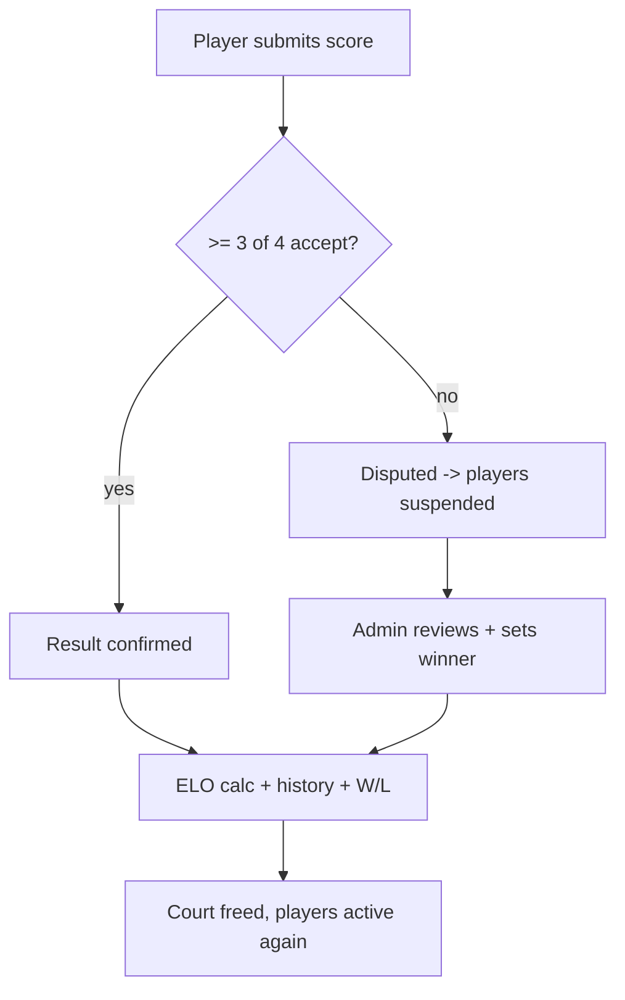
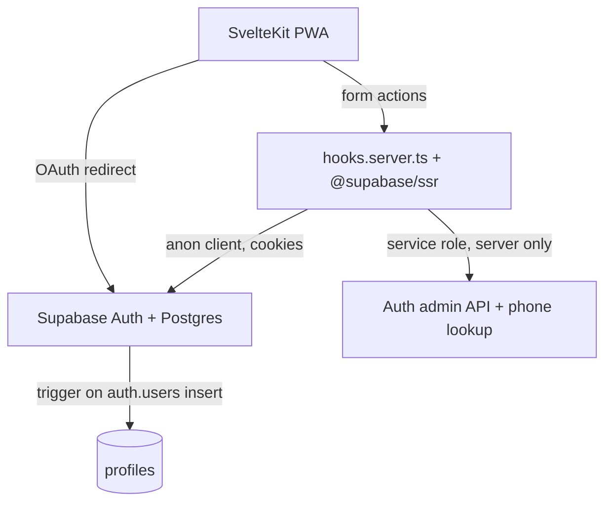

# PH Badminton Club - Project Plan

A mobile-first PWA for organizing 2v2 badminton club sessions: player auth/profile, ELO ranking, geo-discovered sessions, auto/manual matchmaking, peer-confirmed scoring, and free self-generated PromptPay split-cost payments. Everything runs on free tiers.

> This is the living big-picture plan. Each phase below has a status. When starting a new phase, read this file first for context, implement, then update the phase status and notes here.

## Monorepo layout

```
ph-badminton-club-project/
├── docs/PROJECT_PLAN.md      # this file
├── supabase/                 # Shared DB schema & migrations
├── player-app/               # Player PWA (SvelteKit) — Phase 1 done
├── admin-app/                # Admin PWA (SvelteKit) — not scaffolded yet
└── package.json              # Yarn workspaces root
```

- **Player app:** `player-app/` — auth, profile, sessions, matches, payments
- **Admin app:** `admin-app/` — super-admin club management (Phase 2a); session/match management (future phases)
- **Shared backend:** Supabase migrations in `supabase/` (repo root); both apps use the same Supabase project

**Root scripts:** `yarn dev:player`, `yarn dev:admin`, `yarn build:player`, `yarn build:admin`, `yarn check:player`, `yarn check:admin`, `yarn test:player`, `yarn test:admin`

## Tech stack tree (all free tier)

- **Frontend / PWA**
  - SvelteKit (Svelte 5 runes) + Vite
  - `@vite-pwa/sveltekit` - service worker, manifest, installable, offline shell
  - TailwindCSS + a light component layer (skeleton / shadcn-svelte) for fast mobile UI
  - Web Push API for match/score notifications (graceful fallback to in-app realtime)
- **Backend / data (Supabase free tier)**
  - Postgres + **PostGIS** (session location + nearby queries)
  - Supabase Auth (email/password + Google + Facebook OAuth)
  - Row Level Security (RLS) for player vs club-admin vs super-admin
  - Realtime (live match offers, score confirmations, session updates)
  - Edge Functions (Deno) for trusted logic: matchmaking, ELO calc, payment summary
- **Payments**
  - `promptpay-qr` (npm) generates EMVCo PromptPay payload client-side -> render QR with `qrcode`. No gateway, no fees. Admin manually confirms the transfer.
- **Hosting (free)**
  - Vercel or Cloudflare Pages for the SvelteKit app; Supabase hosts DB/auth/functions
- **Tooling**
  - TypeScript, Zod (validation at trust boundaries), Vitest (logic tests), Playwright (optional e2e later)

## Role hierarchy



## Data model (Postgres) - full target

Single source of truth; ELO is global per player for v1 (simplest correct model). Tables are introduced incrementally per phase; the full target is:

- `profiles` (1:1 with `auth.users`): display_name, avatar_url, email, phone (unique), app_role (player|club_admin|super_admin)
- `clubs`: name, owner_id (super admin), max_active_sessions
- `club_admins`: club_id, user_id (membership = who can admin a club)
- `player_ratings`: user_id, elo (default 1500), matches_played, wins, losses, status (active|suspended)
- `sessions`: club_id, created_by, name, start_time, end_time, location `geography(Point)`, location_name, court_count, court_fee_per_hour, shuttle_price, max_players, elo_min, elo_max, promptpay_target, promptpay_type (phone|idcard), status (open|active|closed)
- `session_players`: session_id, user_id, status (pending|approved|rejected|active|left|suspended), joined_at, left_at
- `session_courts`: session_id, court_number, status (idle|occupied)
- `matches`: session_id, court_number, mode (auto|manual), status (offered|accepted|in_progress|awaiting_score|disputed|completed|cancelled), started_at, ended_at
- `match_players`: match_id, user_id, team (a|b), accepted (bool)
- `match_results`: match_id, score_a, score_b, submitted_by, status (pending|confirmed|disputed|admin_resolved)
- `match_result_votes`: match_id, user_id, vote (accept|reject) -- needs 3 of 4 to confirm
- `match_shuttle_usage`: match_id, shuttle_count (default 1, admin can add)
- `elo_history`: user_id, match_id, elo_before, elo_after, delta
- `payments`: session_id, user_id, games_count, shuttle_count, court_share, shuttle_share, total_amount, qr_payload, status (pending|submitted|approved)

## Key flows

### 1. Session discovery + join (geo)

Browser GPS read while app is open (HTTPS) -> PostGIS `ST_DWithin` finds nearby open sessions -> player requests join -> admin approves/rejects (also enforces ELO min/max + max_players).



### 2. Matchmaking + accept

Admin picks an idle court + mode. Auto mode: an Edge Function pairs active players by closest ELO into balanced 2v2 teams (team rating = avg of pair). Manual mode: admin hand-picks 4. Offer pushed to all 4; all must accept -> match `in_progress`, court -> occupied.



### 3. Score logging + peer confirmation + dispute

One player submits score -> other 3 vote. >= 3/4 accept (incl. submitter) -> confirmed, ELO calc runs. If rejected (fails 3/4) -> `disputed`, players cannot start a new match (SUSPENDED) until a club admin resolves.



### 4. ELO (doubles)

- Team rating = average of the two players' ELO.
- Expected_A = 1 / (1 + 10^((R_B - R_A)/400)); winner score 1, loser 0.
- delta = K \* (actual - expected), K ~ 32 (configurable, lower at high games_played).
- Apply same delta to both players on a team; write `elo_history` + update `player_ratings`. Recompute rank ordering for the club leaderboard.

### 5. Payment on leave (free PromptPay)

On leave/close, an Edge Function sums the player's games and shuttle usage:

- court_share = court_fee_per_hour prorated across the games the player joined
- shuttle_share = sum over player's matches of (shuttle_price \* shuttle_count / 4)
- total -> generate PromptPay payload (`promptpay-qr` from admin's phone/id + amount) -> render QR -> player pays in banking app -> player marks submitted -> admin confirms -> status approved -> player may leave.

## Module mapping (scaffold -> build)

- **Player (`player-app/`):** Auth/Profile, Ranking/ELO, Session/Match, Match History, Payment
- **Admin (`admin-app/`):** Admin panel (reuse auth), Admin hierarchy (clubs/admins), Session management, Match management (assign, add shuttles, resolve disputes)

Player routes under `player-app/src/routes/`; admin routes under `admin-app/src/routes/` when scaffolded. Shared Supabase client + typed DB in each app's `src/lib/`.

## Global notes / accepted simplifications

- PWA "geofencing" = foreground GPS proximity only (no background triggers). Covers courtside discovery.
- iOS web push requires installed-to-home-screen (16.4+); in-app realtime is the always-on fallback.
- ELO is global, not per-club, for v1.
- PromptPay is self-generated + manually confirmed (no auto reconciliation).

## Phased roadmap & status

| Phase | Scope                                                                                         | Status      |
| ----- | --------------------------------------------------------------------------------------------- | ----------- |
| 1     | Player Auth & Profile (email/phone + password, Google, Facebook, 7-day session, profile edit) | Completed   |
| 2     | DB schema + RLS + roles + clubs / admin hierarchy                                             | In progress (super admin subset done) |
| 3     | Sessions (CRUD, geo discovery, join/approve)                                                  | Not started |
| 4     | Matchmaking (manual then auto) + match accept + realtime offers                               | Not started |
| 5     | Scoring + peer confirmation + dispute/suspend + admin resolve                                 | Not started |
| 6     | ELO engine + history + leaderboard                                                            | Not started |
| 7     | Payment summary + PromptPay QR + admin confirm                                                | Not started |
| 8     | Push notifications + offline polish + final QA                                                | Not started |

---

## Phase 1 - Player Auth & Profile (detailed spec)

First MVP module: register/login with email OR phone + password, plus Google & Facebook, 7-day sessions, and a profile page to edit display name + avatar. Email, phone, and password are read-only this phase (changed by admin in a later phase).

### Locked decisions

- Email + password is the real underlying credential. Phone-only users get a deterministic synthesized internal email (`<e164phone>@phone.ph-badminton.local`); no SMS, fully free.
- Register requires: display name + password + (email OR phone, at least one; both unique).
- No email verification - instant login after register (user created via admin API with `email_confirm: true`, so it works regardless of dashboard toggle).
- Session lasts 7 days (auth cookie `maxAge` + Supabase session time-box).
- Profile editable: display name, avatar. Read-only: email, phone, password (request admin).
- OAuth: Google + Facebook.

### Architecture



Auth runs in SvelteKit server form actions using `@supabase/ssr` (sets HttpOnly cookies). The service-role key stays server-only (`$env/static/private`) and is used for: uniqueness pre-checks, `admin.createUser`, and resolving phone -> account email before sign-in.

### Phase 1 data model (`supabase/migrations/0001_init.sql`)

- `profiles`: `id uuid PK references auth.users on delete cascade`, `display_name text not null`, `avatar_url text`, `email text`, `phone text unique`, `app_role text default 'player'`, `created_at`, `updated_at`
- `handle_new_user()` trigger on `auth.users` insert -> inserts profile from `raw_user_meta_data` (covers password AND OAuth signups uniformly): display_name from `display_name`/`full_name`/`name`, avatar from `avatar_url`/`picture`, phone from metadata, email left null when the auth email is the synthesized `@phone.ph-badminton.local` domain.
- `lock_readonly_fields()` BEFORE UPDATE trigger: rejects changes to `phone`/`email`/`app_role` unless caller is admin (enforces "request admin" rule).
- RLS: select own profile; update own profile (read-only fields still blocked by trigger).
- Storage: public `avatars` bucket; insert/update policy restricted to a folder prefixed by the user's id.

### Auth logic (`player-app/src/lib/server/auth.ts`)

- `normalizePhone(input)` -> E.164 for Thailand (`0xxxxxxxxx` -> `+66xxxxxxxxx`, accept existing `+`). `ponytail:` basic TH-only normalization, upgrade to libphonenumber if more countries needed.
- `isEmail(identifier)` to branch login.
- `resolveLoginEmail(identifier)`: if email, use as-is; if phone, normalize -> query `profiles` by phone (service role) -> `admin.getUserById` -> return auth email. `ponytail:` pre-auth phone lookup allows registration probing; rate-limit later.
- Register: validate (Zod), normalize phone, check email/phone uniqueness, build auth email (real email or synthesized), `admin.createUser({ email, password, email_confirm: true, user_metadata })`, then `signInWithPassword` to start the session.

### Routes (`player-app/src/routes`)

- `(auth)/register/+page.svelte` + `+page.server.ts` - display name, password, one identifier field (email or phone).
- `(auth)/login/+page.svelte` + `+page.server.ts` - single identifier field (auto-detect email/phone) + password; Google/Facebook buttons.
- `auth/callback/+server.ts` - exchanges OAuth code for session, redirects to profile.
- `(player)/profile/+page.svelte` + `+page.server.ts` - edit display name + avatar upload (Supabase Storage); email/phone shown read-only with a "contact admin to change" note.
- `logout/+page.server.ts` - signOut.
- `+layout.server.ts` / `+layout.svelte` / `hooks.server.ts` - supabase client, session load, guard protected `(player)` routes.

### Scaffold + config

- Init SvelteKit (TS) + Tailwind + `@vite-pwa/sveltekit` (minimal manifest/service worker; full offline polish in Phase 8).
- Deps: `@supabase/supabase-js`, `@supabase/ssr`, `zod`; dev: `vitest`.
- Env: `PUBLIC_SUPABASE_URL`, `PUBLIC_SUPABASE_PUBLISHABLE_KEY` (`sb_publishable_...`), `SUPABASE_SECRET_KEY` (`sb_secret_...`, server-only).
- Auth cookie `maxAge = 60*60*24*7`.

### Check (one runnable test)

- `player-app/src/lib/server/auth.test.ts` (Vitest): `normalizePhone` cases (`0812345678` -> `+66812345678`, idempotent on `+66...`) and `isEmail` detection.

### Manual steps (Supabase dashboard)

- Create the Supabase project; copy URL + anon + service_role keys into `player-app/.env`.
- Auth > Providers: enable Google and Facebook (paste each provider's client id/secret; redirect to `/auth/callback`).
- Auth > Sessions: set time-box to 168 hours (7 days).
- Run the migration (Supabase CLI or SQL editor).

### Out of scope (Phase 1)

ELO, sessions, matches, payments, push notifications, self-service email/phone/password change.

---

## Phase 2a - Admin app super admin (detailed spec)

Super-admin bootstrap and club management in `admin-app/`. Club-admin admin-app access is deferred to Phase 2b; assigned club admins exist in DB but cannot sign in to admin-app yet.

### Role capabilities (v1)

| Role | Admin-app access | Capabilities |
| ---- | ---------------- | ------------ |
| **Super Admin** | Yes | Create/update/delete clubs, set max active sessions, assign/remove club admins, search all profiles |
| **Club Admin** | No (Phase 2b) | Row in `club_admins`; `app_role` synced to `club_admin` when assigned |
| **Player** | No | — |

### Bootstrap first super admin

1. User registers via player-app (normal account).
2. Set `MASTER_KEY_SHA256` in `admin-app/.env` (SHA-256 hex of a strong raw secret — never store the raw key in env).
3. One-time POST to the backdoor endpoint:

```bash
curl -X POST http://localhost:5174/api/internal/promote-superadmin \
  -H "Content-Type: application/json" \
  -H "x-master-key: YOUR_RAW_SECRET" \
  -d '{"userId":"USER_UUID_HERE"}'
```

4. That user signs in at admin-app (`yarn dev:admin`, port 5174).

Generate hash: `node -e "console.log(require('crypto').createHash('sha256').update('your-secret').digest('hex'))"`

### Phase 2a data model (`supabase/migrations/0003_clubs_admin.sql`)

- `clubs`: `name`, `description`, `max_active_sessions`, `owner_id` (creating super admin)
- `club_admins`: `club_id`, `user_id`, `assigned_by`
- `sync_club_admin_role()` trigger: promote `player` → `club_admin` on assign; demote to `player` when removed from last club; never changes `super_admin`
- RLS: super admin full CRUD on `clubs` / `club_admins`; super admin can select all `profiles` (user pool search)

### Admin-app env (`admin-app/.env.example`)

Same Supabase keys as player-app, plus:

- `PORT=5174`
- `MASTER_KEY_SHA256` — hex SHA-256 of bootstrap secret (server-only)

### Supabase dashboard (manual)

- Auth > URL configuration: add redirect `http://localhost:5174/auth/callback` (and production admin URL when deployed).
- Run `yarn db:push` after pulling migration `0003_clubs_admin.sql`.

### Admin routes (`admin-app/src/routes`)

- `(auth)/login/` — email/phone + password + Google/Facebook; no register
- `auth/callback/+server.ts` — OAuth session exchange
- `api/internal/promote-superadmin/+server.ts` — master-key backdoor (not linked from UI)
- `(admin)/` — club list
- `(admin)/clubs/new/` — create club
- `(admin)/clubs/[id]/` — edit club, assign/remove admins, delete club
- `hooks.server.ts` — super-admin-only guard (non-super-admins signed out)

### Out of scope (Phase 2a)

Club-admin admin-app UI, session/match management, demote super admin via UI, rate limiting on backdoor endpoint.
