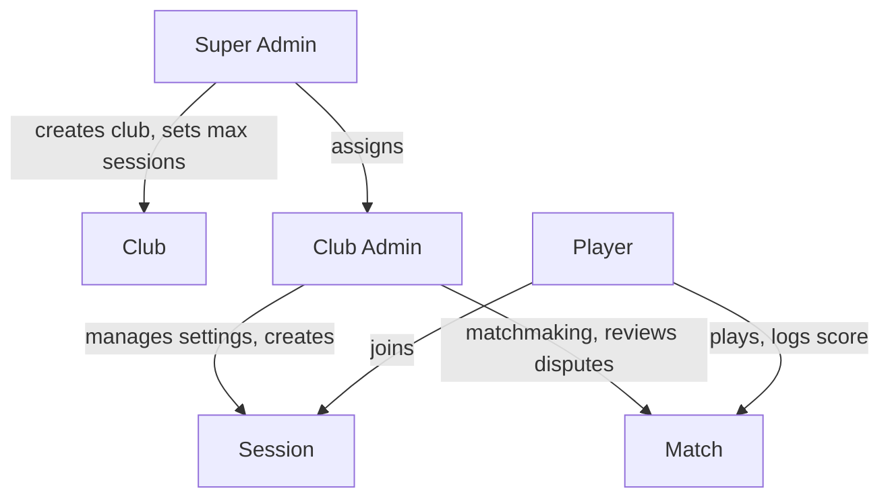
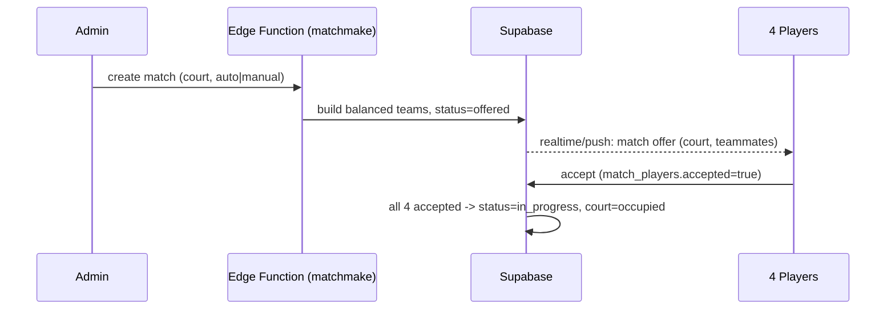
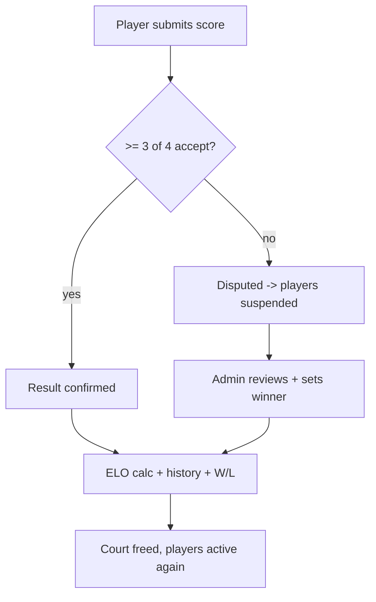
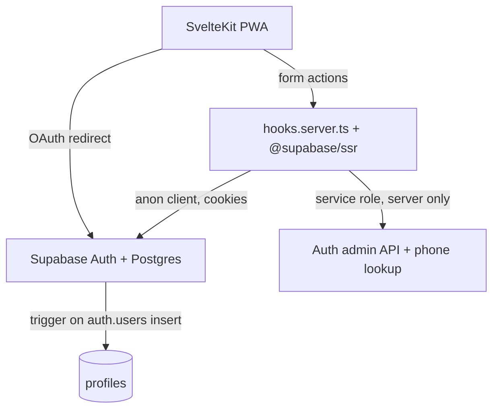

# PH Badminton Club - Project Plan

A mobile-first PWA for organizing 2v2 badminton club sessions: player auth/profile, ELO ranking, geo-discovered sessions, auto/manual matchmaking, peer-confirmed scoring, and free self-generated PromptPay split-cost payments. Everything runs on free tiers.

> This is the living big-picture plan. Each phase below has a status. When starting a new phase, read this file first for context, implement, then update the phase status and notes here.

## Monorepo layout

```
ph-badminton-club-project/
├── docs/PROJECT_PLAN.md      # this file
├── shared/ui/                # Shared dashboard UI (both apps import via @repo/ui)
├── supabase/                 # Shared DB schema & migrations
├── player-app/               # Player PWA (SvelteKit) — Phase 1–3 done; Phase 7 payments in progress
├── admin-app/                # Admin PWA (SvelteKit) — Phase 2–3 done; Phase 7 payments in progress
└── package.json              # Yarn workspaces root
```

- **Player app:** `player-app/` — auth, profile, session discovery/join, live session (Realtime), early-leave + PromptPay payment, cancellation-fee payment, transaction history
- **Admin app:** `admin-app/` — super-admin club/user management (Phase 2a); club-admin dashboard/settings (Phase 2b); sessions create/list/detail/join management + full lifecycle + live **session control** (settlement, payment approval, leave approval, close) + cancellation-fee confirm/waive + transactions
- **Shared backend:** Supabase migrations in `supabase/` (repo root); both apps use the same Supabase project

**Root scripts:** `yarn dev:player`, `yarn dev:admin`, `yarn build:player`, `yarn build:admin`, `yarn check:player`, `yarn check:admin`, `yarn test:player`, `yarn test:admin`, `yarn db:push` (apply Supabase migrations)

## Tech stack tree (all free tier)

- **Frontend / PWA**
  - SvelteKit (Svelte 5 runes) + Vite
  - `@vite-pwa/sveltekit` - service worker, manifest, installable, offline shell
  - TailwindCSS v4 + shared dashboard UI in `shared/ui/` (hero banners, launcher tiles, cards)
  - Web Push API for match/score notifications (graceful fallback to in-app realtime)
- **Backend / data (Supabase free tier)**
  - Postgres + **PostGIS** (session location + nearby queries)
  - Supabase Auth (email/password + Google + Facebook OAuth)
  - Row Level Security (RLS) for player vs club-admin vs super-admin
  - Realtime (live match offers, score confirmations, session updates)
  - Edge Functions (Deno) for trusted logic: matchmaking, ELO calc, payment summary
- **Payments**
  - `promptpay-qr` (npm) generates EMVCo PromptPay payload client-side -> render QR with `qrcode`. No gateway, no fees. Admin manually confirms the transfer.
- **Hosting (free)**
  - Vercel or Cloudflare Pages for the SvelteKit app; Supabase hosts DB/auth/functions
- **Tooling**
  - TypeScript, Zod (validation at trust boundaries), Vitest (logic tests), Playwright (optional e2e later)

## UI design system (shared — both apps)

Both `player-app` and `admin-app` import shared UI from `shared/ui/` via the `@repo/ui` alias (configured in each app's `svelte.config.js`). Styles live in `shared/ui/styles/design-system.css`, imported from each app's `app.css`. Tailwind scans `shared/ui/**` via `@source`.

### Visual language

- **Mobile-first** shell: `max-w-lg`, light slate background, purple brand (`#964ac0`)
- **Rounded surfaces**: prefer `rounded-3xl` for hero/cards/tiles (softer than old `rounded-2xl` lists)
- **Motion**: tile hover lift (`-translate-y-0.5`), icon scale on hover; respect `prefers-reduced-motion`

### Core patterns

| Pattern | Component / class | Use for |
| ------- | ----------------- | ------- |
| **Dashboard hero** | `DashboardHero` / `.app-hero` | Page welcome banner — gradient purple, white text, eyebrow + title + subtitle |
| **Launcher tile** | `DashboardTile` / `.app-tile` | Big icon + label grid actions (quick actions, featured sessions) |
| **Action row** | `ActionRowLink` / `.app-action-row` | Horizontal link rows with icon + arrow (menu, browse-all) |
| **Filter bar** | `.app-filter-row` | Search + select + optional submit (Users, All clubs) |
| **List row** | bordered `ul` + hover row | Users list, All clubs list (super admin) |
| **Section label** | `SectionHeading` / `.app-section-heading` | Uppercase “Quick actions”, “All clubs”, etc. |
| **Content card** | `AppCard` / `.app-card-padded` | Forms, settings sections, login boxes |
| **Empty state** | `EmptyState` / `.app-empty` | No data placeholders |
| **Muted panel** | `.app-muted-panel` | Secondary info (account details on profile) |

### DashboardTile spec

- Gradient icon box: `from-brand-500 to-brand-700`, 64×64 default / 80×80 `large`
- Supports `href` (link) or `onclick` (button) — e.g. player club browse opens bottom sheet
- Optional `badge` (e.g. “Inactive”), `description` subtitle
- Grid: `grid-cols-2 gap-4`; single primary action may use `grid-cols-1` + `large`

### Brand tokens (`@theme` in each app `app.css`)

`brand-50` … `brand-900` including `brand-300`, `brand-400`, `brand-500` for gradients and shadows.

### When adding new screens

1. Start with `DashboardHero` (or compact heading for dense forms)
2. Primary actions → `DashboardTile` grid under `SectionHeading`
3. Forms / detail blocks → `AppCard`
4. Reuse icons from `shared/ui/icons/` before adding app-local duplicates

## Role hierarchy



## Data model (Postgres) - full target

Single source of truth; ELO is global per player for v1 (simplest correct model). Tables are introduced incrementally per phase; the full target is:

- `profiles` (1:1 with `auth.users`): display_name, avatar_url, email, phone (unique), app_role (player|club_admin|super_admin)
- `clubs`: name, owner_id (super admin), max_active_sessions
- `club_admins`: club_id, user_id (membership = who can admin a club)
- `player_ratings`: user_id, elo (default 1500), matches_played, wins, losses, status (active|suspended)
- `sessions`: club_id, host_id, name, description, start_at, end_at, **finished_at**, **ended_early**, venue_name, latitude, longitude, court_count, court_fee_per_hour, shuttle_id, shuttle_price_per_each, max_players, min_players, match_score_type, match_type, **cancellation_fee**, **max_buffer**, **promptpay_type**, **promptpay_target**, **cancel_source / cancel_reason / cancelled_by**, status (**draft**|open|in_progress|closed|cancelled). Target (not yet): `geography(Point)`, elo_min, elo_max.
- `session_players`: session_id, user_id, status (**waiting|queued|confirmed|rejected|cancelled|left**), **activity (idle|playing|break|billing)**, **idle_since**, fee_owed, **fee_status (none|owed|submitted|paid|waived)**, **fee_paid_at**, **fee_decided_by**, joined_at, decided_at, left_at. Writes via RPC only (`join_session`, `cancel_session_membership`, `confirm_session_player`, `reject_session_player`, `leave_session`, `set_session_break`, `submit_cancellation_fee`, `confirm_cancellation_fee`, `waive_cancellation_fee`).
- `session_leave_requests`: session_id, user_id, status (pending|approved|rejected|cancelled), requested_at, decided_by, decided_at. Early-leave during `in_progress`; one pending per player. Writes via RPC only.
- `session_courts`: session_id, court_number, status (idle|occupied)
- `matches`: session_id, court_number, mode (auto|manual), status (offered|accepted|in_progress|awaiting_score|disputed|completed|cancelled), started_at, ended_at
- `match_players`: match_id, user_id, team (a|b), accepted (bool)
- `match_results`: match_id, score_a, score_b, submitted_by, status (pending|confirmed|disputed|admin_resolved)
- `match_result_votes`: match_id, user_id, vote (accept|reject) -- needs 3 of 4 to confirm
- `match_shuttle_usage`: match_id, shuttle_count (default 1, admin can add)
- `elo_history`: user_id, match_id, elo_before, elo_after, delta
- `payments`: session_id, user_id, court_share, shuttle_share (0 until Phase 4 match data), total_amount, status (pending|submitted|approved), decided_by, decided_at. **Implemented** (`0024`); one row per session+user, written via RPC only (`begin_session_settlement`, `submit_payment`, `approve_payment`). QR is generated client-side (no stored `qr_payload`).

## Key flows

### 1. Session discovery + join

**Implemented (Phase 3):** Player browses upcoming open sessions at `/sessions`, sorted client-side by haversine distance (stored user location in localStorage) then soonest `start_at`. Home dashboard shows **My sessions** (joined upcoming + in_progress). Player opens detail bottom sheet, joins via `join_session` RPC → **waiting** (counts toward `max_players`) or **queued** (overflow up to `max_buffer`). Join allowed on **`in_progress`** until 30 min before `end_at`. Club admin confirms/rejects waiting players on session detail from **15 min before start until end** (page refresh, no realtime yet). Auto-cancel underfilled sessions at T−15 min and at `start_at`; enough confirmed players → **`in_progress`**. Player can cancel waiting (free if >1 hr before start; else `fee_owed = cancellation_fee`, `fee_status = 'owed'`, collected via PromptPay QR → admin confirm/waive) or cancel queued anytime (free). **Waiting players cannot self-cancel within 15 min of `start_at`** — must ask admin to reject, or play and request early leave (`0029`). One non-overlapping session membership at a time; blocked while any `fee_owed > 0`.

**Target (later):** PostGIS `ST_DWithin` for server-side geo filter; Supabase Realtime for join notifications; ELO min/max gates.

```mermaid
sequenceDiagram
  participant P as Player (PWA)
  participant DB as Supabase
  participant A as Club Admin
  P->>DB: list upcoming sessions + join_session RPC
  DB-->>P: status waiting or queued
  A->>DB: confirm_session_player / reject_session_player (15m pre-start..end)
  DB-->>P: status confirmed or rejected
  Note over P,DB: cancel frees slot; oldest queued auto-promoted to waiting
```

### 2. Matchmaking + accept

Admin picks an idle court + mode. Auto mode: an Edge Function pairs active players by closest ELO into balanced 2v2 teams (team rating = avg of pair). Manual mode: admin hand-picks 4. Offer pushed to all 4; all must accept -> match `in_progress`, court -> occupied.



### 3. Score logging + peer confirmation + dispute

One player submits score -> other 3 vote. >= 3/4 accept (incl. submitter) -> confirmed, ELO calc runs. If rejected (fails 3/4) -> `disputed`, players cannot start a new match (SUSPENDED) until a club admin resolves.



### 4. ELO (doubles)

- Team rating = average of the two players' ELO.
- Expected_A = 1 / (1 + 10^((R_B - R_A)/400)); winner score 1, loser 0.
- delta = K \* (actual - expected), K ~ 32 (configurable, lower at high games_played).
- Apply same delta to both players on a team; write `elo_history` + update `player_ratings`. Recompute rank ordering for the club leaderboard.

### 5. Payment on leave / close (free PromptPay) — **implemented (court share)**

Settlement runs in `security definer` RPCs (no Edge Function needed yet), surfaced live over Realtime
on player `/sessions/[id]/live` and admin `/sessions/[id]/control`:

- **court_share** = `compute_session_court_share` = court_fee_per_hour × hours × court_count ÷ active_players (`confirmed` + `left`). **shuttle_share** stays 0 until Phase 4 records matches.
- **Live activity (`0030`):** confirmed players have `activity` (`idle|playing|break|billing`) + `idle_since`. Player toggles break via `set_session_break`. Leave/settlement sets `activity='billing'`; cancel leave resets to `idle`. UI labels/badges via `@repo/ui/sessionStatus`; idle timer uses `clampIdleSince` so pre-start idle never shows negative uptime.
- **Early leave (during `in_progress`):** player `request_session_leave` → snapshots a `pending` payment → `activity='billing'` → pays via client PromptPay QR (`PaymentQr`) → `submit_payment` → admin `approve_payment` → admin `approve_session_leave` (requires approved payment) → player set `left`.
- **End early (`0031`):** admin `end_session_early` during `in_progress` → sets `ended_early`, bills all confirmed players immediately → admin approves payments → `close_session` allowed before scheduled `end_at` when `ended_early`.
- **Close:** admin `begin_session_settlement` writes each confirmed player a payment → players pay → admin `approve_payment` each → `close_session` (after `end_at` **or** `ended_early`, all confirmed players have an `approved` payment, and all cancellation fees resolved) → players `left`, session `closed`.
- PromptPay target snapshots per session (`promptpay_type` / `promptpay_target`, falling back to club defaults); QR rendered client-side with `promptpay-qr` + `qrcode` (player-app only).

## Module mapping (scaffold -> build)

- **Player (`player-app/`):** Auth/Profile, Ranking/ELO, Session/Match, Match History, Payment
- **Admin (`admin-app/`):** Admin panel (reuse auth), Admin hierarchy (clubs/admins), Session management, Match management (assign, add shuttles, resolve disputes)

Player routes under `player-app/src/routes/`; admin routes under `admin-app/src/routes/` when scaffolded. Shared Supabase client + typed DB in each app's `src/lib/`.

## Global notes / accepted simplifications

- PWA "geofencing" = foreground GPS proximity only (no background triggers). Covers courtside discovery.
- iOS web push requires installed-to-home-screen (16.4+); in-app realtime is the always-on fallback.
- ELO is global, not per-club, for v1.
- PromptPay is self-generated + manually confirmed (no auto reconciliation).

## Phased roadmap & status

| Phase | Scope                                                                                         | Status      |
| ----- | --------------------------------------------------------------------------------------------- | ----------- |
| 1     | Player Auth & Profile (email/phone + password, Google, Facebook, 7-day session, profile edit) | Completed   |
| 2     | DB schema + RLS + roles + clubs / admin hierarchy + club settings                             | Completed   |
| 3     | Sessions (CRUD, geo discovery, join/waitlist/queue, admin confirm, full lifecycle, live + control) | Completed   |
| 4     | Matchmaking (manual then auto) + match accept + realtime offers                               | Not started |
| 5     | Scoring + peer confirmation + dispute/suspend + admin resolve                                 | Not started |
| 6     | ELO engine + history + leaderboard                                                            | Not started |
| 7     | Payment summary + PromptPay QR + admin confirm                                                | In progress (court-share settlement + leave + cancellation-fee collection done over Realtime; **shuttle share** waits on Phase 4 match data) |
| 8     | Push notifications + offline polish + final QA                                                | Not started |

---

## Phase 1 - Player Auth & Profile (detailed spec)

First MVP module: register/login with email OR phone + password, plus Google & Facebook, 7-day sessions, and a profile page to edit display name + avatar. Email, phone, and password are read-only this phase (changed by admin in a later phase).

### Locked decisions

- Email + password is the real underlying credential. Phone-only users get a deterministic synthesized internal email (`<e164phone>@phone.ph-badminton.local`); no SMS, fully free.
- Register requires: display name + password + (email OR phone, at least one; both unique).
- No email verification - instant login after register (user created via admin API with `email_confirm: true`, so it works regardless of dashboard toggle).
- Session lasts 7 days (auth cookie `maxAge` + Supabase session time-box).
- Profile editable: display name, avatar. Read-only: email, phone, password (request admin).
- OAuth: Google + Facebook.

### Architecture



Auth runs in SvelteKit server form actions using `@supabase/ssr` (sets HttpOnly cookies). The service-role key stays server-only (`$env/static/private`) and is used for: uniqueness pre-checks, `admin.createUser`, and resolving phone -> account email before sign-in.

### Phase 1 data model (`supabase/migrations/0001_init.sql`)

- `profiles`: `id uuid PK references auth.users on delete cascade`, `display_name text not null`, `avatar_url text`, `email text`, `phone text unique`, `app_role text default 'player'`, `created_at`, `updated_at`
- `handle_new_user()` trigger on `auth.users` insert -> inserts profile from `raw_user_meta_data` (covers password AND OAuth signups uniformly): display_name from `display_name`/`full_name`/`name`, avatar from `avatar_url`/`picture`, phone from metadata, email left null when the auth email is the synthesized `@phone.ph-badminton.local` domain.
- `lock_readonly_fields()` BEFORE UPDATE trigger: rejects changes to `phone`/`email`/`app_role` unless caller is admin (enforces "request admin" rule).
- RLS: select own profile; update own profile (read-only fields still blocked by trigger).
- Storage: public `avatars` bucket; insert/update policy restricted to a folder prefixed by the user's id.

### Auth logic (`player-app/src/lib/server/auth.ts`)

- `normalizePhone(input)` -> E.164 for Thailand (`0xxxxxxxxx` -> `+66xxxxxxxxx`, accept existing `+`). `ponytail:` basic TH-only normalization, upgrade to libphonenumber if more countries needed.
- `isEmail(identifier)` to branch login.
- `resolveLoginEmail(identifier)`: if email, use as-is; if phone, normalize -> query `profiles` by phone (service role) -> `admin.getUserById` -> return auth email. `ponytail:` pre-auth phone lookup allows registration probing; rate-limit later.
- Register: validate (Zod), normalize phone, check email/phone uniqueness, build auth email (real email or synthesized), `admin.createUser({ email, password, email_confirm: true, user_metadata })`, then `signInWithPassword` to start the session.

### Routes (`player-app/src/routes`)

- `(auth)/register/+page.svelte` + `+page.server.ts` - display name, password, one identifier field (email or phone).
- `(auth)/login/+page.svelte` + `+page.server.ts` - single identifier field (auto-detect email/phone) + password; Google/Facebook buttons.
- `auth/callback/+server.ts` - exchanges OAuth code for session, redirects to profile.
- `(player)/profile/+page.svelte` + `+page.server.ts` - edit display name + avatar upload (Supabase Storage); email/phone shown read-only with a "contact admin to change" note.
- `logout/+page.server.ts` - signOut.
- `+layout.server.ts` / `+layout.svelte` / `hooks.server.ts` - supabase client, session load, guard protected `(player)` routes.

### Scaffold + config

- Init SvelteKit (TS) + Tailwind + `@vite-pwa/sveltekit` (minimal manifest/service worker; full offline polish in Phase 8).
- Deps: `@supabase/supabase-js`, `@supabase/ssr`, `zod`; dev: `vitest`.
- Env: `PUBLIC_SUPABASE_URL`, `PUBLIC_SUPABASE_PUBLISHABLE_KEY` (`sb_publishable_...`), `SUPABASE_SECRET_KEY` (`sb_secret_...`, server-only).
- Auth cookie `maxAge = 60*60*24*7`.

### Check (one runnable test)

- `player-app/src/lib/server/auth.test.ts` (Vitest): `normalizePhone` cases (`0812345678` -> `+66812345678`, idempotent on `+66...`) and `isEmail` detection.

### Manual steps (Supabase dashboard)

- Create the Supabase project; copy URL + anon + service_role keys into `player-app/.env`.
- Auth > Providers: enable Google and Facebook (paste each provider's client id/secret; redirect to `/auth/callback`).
- Auth > Sessions: set time-box to 168 hours (7 days).
- Run the migration (Supabase CLI or SQL editor).

### Out of scope (Phase 1)

ELO, sessions, matches, payments, push notifications, self-service email/phone/password change.

---

## Phase 2a - Admin app super admin (detailed spec)

Super-admin bootstrap and club management in `admin-app/`. Club-admin admin-app access is implemented in Phase 2b (see below).

### Role capabilities (v1)

| Role | Admin-app access | Capabilities |
| ---- | ---------------- | ------------ |
| **Super Admin** | Yes | Create/update/delete clubs, set max active sessions, assign/remove club admins, user management (`/users`) |
| **Club Admin** | Yes (Phase 2b) | Row in `club_admins`; signs in to `/dashboard`; club settings for assigned clubs |
| **Player** | No | — |

### Bootstrap first super admin

1. User registers via player-app (normal account).
2. Set `MASTER_KEY_SHA256` in `admin-app/.env` (SHA-256 hex of a strong raw secret — never store the raw key in env).
3. One-time POST to the backdoor endpoint:

```bash
curl -X POST http://localhost:5174/api/internal/promote-superadmin \
  -H "Content-Type: application/json" \
  -H "x-master-key: YOUR_RAW_SECRET" \
  -d '{"userId":"USER_UUID_HERE"}'
```

4. That user signs in at admin-app (`yarn dev:admin`, port 5174).

Generate hash: `node -e "console.log(require('crypto').createHash('sha256').update('your-secret').digest('hex'))"`

### Phase 2a data model (`supabase/migrations/0003_clubs_admin.sql`)

- `clubs`: `name`, `description`, `max_active_sessions`, `owner_id` (creating super admin)
- `club_admins`: `club_id`, `user_id`, `assigned_by`
- `sync_club_admin_role()` trigger: promote `player` → `club_admin` on assign; demote to `player` when removed from last club; never changes `super_admin`
- RLS: super admin full CRUD on `clubs` / `club_admins`; super admin can select all `profiles` (user pool search)

### Admin-app env (`admin-app/.env.example`)

Same Supabase keys as player-app, plus:

- `PORT=5174`
- `MASTER_KEY_SHA256` — hex SHA-256 of bootstrap secret (server-only)
- Auth cookie `maxAge` = 30 days (`SESSION_MAX_AGE` in `admin-app/src/lib/types/auth.ts`)

### Supabase dashboard (manual)

- Auth > URL configuration: add redirect `http://localhost:5174/auth/callback` (and production admin URL when deployed).
- Auth > Sessions: set time-box to **720 hours (30 days)** so admin refresh tokens outlive the player-app 7-day default if both apps share one project (use the longer value project-wide).
- Run `yarn db:push` after pulling migration `0003_clubs_admin.sql`.

### Admin routes (`admin-app/src/routes`)

- `(auth)/login/` — email/phone + password + Google/Facebook; no register
- `auth/callback/+server.ts` — OAuth session exchange
- `api/internal/promote-superadmin/+server.ts` — master-key backdoor (not linked from UI)
- `(admin)/` — super-admin home (quick actions + searchable **All clubs** list)
- `(admin)/users/`, `(admin)/users/[id]/` — user search, role view, ban/delete (super admin)
- `(admin)/set-dashboard-mode/` — cookie POST to switch super ↔ club workspace (dual-role super admin)
- `(admin)/clubs/new/` — create club
- `(admin)/clubs/[id]/` — edit club, assign/remove admins, delete club
- `hooks.server.ts` — super-admin-only guard (non-super-admins signed out)

### Out of scope (Phase 2a)

Session/match management, demote super admin via UI, rate limiting on backdoor endpoint. (Club-admin UI delivered in Phase 2b.)

---

## Phase 2b - Club admin dashboard and settings (detailed spec)

Club admins can sign in to `admin-app`, land on `/dashboard`, and open club settings from launcher tiles.

### Role capabilities (updated)

| Role | Admin-app access | Capabilities |
| ---- | ---------------- | ------------ |
| **Super Admin** | Yes (`/`) | All clubs, create/delete, assign admins, full club settings |
| **Club Admin** | Yes (`/dashboard`) | Assigned clubs only; name/description + shuttles, PromptPay, location |
| **Player** | No | — |

### Admin routes (Phase 2b additions)

- `(admin)/dashboard/` — club admin home (hero + quick actions + ongoing/upcoming session panels when Phase 3 loaded)
- `(admin)/clubs/[id]/` — club settings (role-gated sections)
- `(admin)/set-dashboard-mode/` — workspace switch for super admin with club membership
- `hooks.server.ts` — allows `club_admin`; login → `/dashboard` for club admin, `/` for super admin; dual-role super admin uses cookie `admin_dashboard_mode` (`super` \| `club`)

### Data (`0008_club_settings.sql`)

- `clubs`: `promptpay_type`, `promptpay_target`, `latitude`, `longitude`
- `club_shuttles`: inventory CRUD (speed 75/76, pricing; per-each computed in UI)
- RLS: `is_club_admin_of()` for club admin read/update; trigger guards restricted columns

### UI

Uses shared dashboard design system (see **UI design system** above): `DashboardHero`, `DashboardTile`, `AppCard` on dashboard, settings, login, and profile screens.

---

## Phase 3 — Sessions (admin create + player join + lifecycle)

Admin-app: **create + edit + list + detail + participant management + draft/open lifecycle + live session control** (settlement, payment approval, leave approval, close). Player-app: **browse/join sessions + my joined sessions + live session** (Realtime, early leave, PromptPay payment).

> Phase 3 is **complete**; the live `/control` and `/live` pages plus PromptPay settlement (Phase 7, court share) ship on top of it. Only in-session **match/court** control remains a placeholder (Phase 4).

### Role capabilities (sessions)

| Role | Sessions access | Capabilities |
| ---- | --------------- | ------------ |
| **Super Admin** | `/sessions`, `/sessions/[id]`, `/sessions/history` | View all sessions; **force end** (danger zone); read-only in club workspace for create/edit |
| **Club Admin** | `/sessions`, `/sessions/new`, `/sessions/[id]`, `/sessions/[id]/edit` | Create/edit/cancel own-club sessions; **confirm/reject waiting players** (15 min before start → session end); **Session control** link when `in_progress` |
| **Player** | `/sessions`, `/sessions/history`, `/`, club sheets | Browse upcoming sessions (distance-sorted when location granted); **My sessions** on home; **session history** (filter by status/club/date); join until 30 min before `end_at`; live page when joined + `in_progress` |

### Admin routes (Phase 3)

- `(admin)/sessions/` — upcoming session list (excludes `in_progress`; those on dashboard)
- `(admin)/sessions/history/` — past sessions
- `(admin)/sessions/new/` — create form (club admin / super-admin in club workspace only)
- `(admin)/sessions/[id]/` — session detail + waiting list, buffer queue, confirmed roster; open draft; super-admin force-end
- `(admin)/sessions/[id]/edit/` — edit open/draft session; cancel releases players (`release_active_session_players`)
- `(admin)/sessions/[id]/control/` — **live session control** (in_progress only): **end session early** (bills all), start settlement, approve payments, approve/reject early-leave requests, confirm/waive cancellation fees, close session. Realtime via `depends('app:session-control')`. Courts/matches still placeholder (Phase 4).
- `(admin)/transactions/` — cross-session payment + cancellation-fee history
- `(admin)/dashboard/` — **Ongoing** + **Upcoming** session panels (`UpcomingSessionsPanel`)

### Player routes (Phase 3 + Phase 7)

- `(player)/` — home: **My sessions**, featured sessions, nearby clubs
- `(player)/sessions/` — upcoming session list (`depends('app:sessions')`)
- `(player)/sessions/history/` — past sessions (filter by status, club, date; paginated)
- `(player)/sessions/[id]/live/` — **live session** (joined + `in_progress`): uptime, idle timer, break toggle, roster activity badges, cost estimate, early-leave request, PromptPay payment modal; Realtime via `depends('app:live-session')`
- `(player)/profile/` — outstanding cancellation fees + transaction history (`PlayerTransactionsPanel`)
- `api/sessions/[id]/`, `api/clubs/[id]/` — JSON for bottom sheets
- Form actions on `/sessions`: `join`, `cancel`, `leave`, `submitFee` → Supabase RPCs

### Data (`0012`–`0031` migrations)

- `0012`–`0016` — sessions table, shuttles, venue, `session_players` + join RPCs
- `0017_session_draft.sql` — status includes **`draft`**; default draft on create; must open before start−1 hr
- `0018_session_admin_modify.sql` — `release_active_session_players()` for admin edit/cancel
- `0019`/`0020` — roster RLS for session members (`is_active_session_member()`)
- `0021_session_in_progress.sql` — `start_due_sessions()`; pg_cron; join on `in_progress` until 30 min before `end_at`
- `0022_session_min_players_lifecycle.sql` — min-players auto-cancel + start gate (see lifecycle below)
- `0023_session_live_realtime.sql` — Realtime publication on `sessions` + `session_players`
- `0024_session_payments_leave.sql` — `payments` + `session_leave_requests` tables; settlement/leave/close RPCs; `compute_session_court_share`
- `0025_session_promptpay.sql` — session-level `promptpay_type` / `promptpay_target` snapshot (required on create/edit)
- `0026_session_finished_at.sql` — `finished_at` set on close/cancel (distinct from scheduled `end_at`)
- `0027_cancellation_fee_payments.sql` — `fee_status` lifecycle (owed→submitted→paid/waived) + submit/confirm/waive RPCs
- `0028_session_cancel_reason.sql` — `cancel_source` / `cancel_reason` / `cancelled_by` audit on sessions
- `0029_cancel_lock_before_start.sql` — waiting players cannot self-cancel within 15 min of `start_at`
- `0030_session_player_activity.sql` — `activity` / `idle_since` on `session_players`; `set_session_break`; leave/settlement sets `billing`
- `0031_session_end_early.sql` — `ended_early` flag; `end_session_early` RPC; `close_session` allows close before `end_at` when ended early

- `clubs.venue_name` — default venue label prefilled on session create
- `sessions`: … `status` (`draft` \| `open` \| `in_progress` \| `closed` \| `cancelled`), **`ended_early`**, …
- `session_players`: … **`activity`**, **`idle_since`**. All writes through security-definer RPCs.

All session datetimes stored as `timestamptz` (UTC); UI inputs/display use the **viewer's device timezone** (see `shared/ui/datetime.ts`).

Create enforces club `max_active_sessions` (counts sessions with status `open` or `in_progress`).

Join rules (RPC-enforced): capacity = `waiting` + `confirmed` vs `max_players`; overflow → `queued` up to `max_buffer`; no overlapping memberships; not while confirmed in another `in_progress` session; block join while any outstanding fee (`fee_owed > 0 and fee_status in ('owed','submitted')`); auto-promote oldest queued when a waiting slot frees; **`join_session` accepts `open` or `in_progress` until 30 min before `end_at`**.

Session lifecycle (`start_due_sessions` RPC + pg_cron every minute when available; **lazy sweep** via `sweepStartedSessions()` on admin/player page loads — required in local dev without pg_cron):

1. **T−15 min → start** (same window as admin confirm/reject): if `(waiting + confirmed) < min_players` → `cancelled`, release all active players (free).
2. **At `start_at`**: if `confirmed < min_players` → `cancelled`, release players; else `open` → **`in_progress`**.
3. Already-`in_progress` sessions are not retroactively cancelled by the sweep — fix bad data manually.

Draft lifecycle (separate): overdue drafts auto-cancel if not opened 1 hr before start (`sweepOverdueDraftSessions` on admin load). All cancels (system sweeps + admin) record `cancel_source` / `cancel_reason` / `cancelled_by`; `finished_at` is stamped on close/cancel.

Close is **admin-driven** (`close_session`, gated on `end_at` **or** `ended_early`, all payments approved, fees resolved) — there is no automatic `closed` transition yet.

### Payment formulas (locked)

When a player leaves or a session ends, per-player charges:

- **Court share** = `court_fee_per_hour × duration_hours × court_count ÷ active_players` — **implemented** (`compute_session_court_share`; active = `confirmed` + `left`)
  - Example: 200 THB/hr × 4 hrs × 4 courts ÷ 10 players = **320 THB**
- **Shuttle share** = `(shuttle_price_per_each ÷ 4) × games_played_by_player` — **deferred to Phase 4** (no match data yet; stored as 0)
  - Example: (80 ÷ 4) × 5 games = **100 THB**
- **Session total** = court_share + shuttle_share (example → **420 THB**)

`shuttle_price_per_each` is set per session (may differ from club default for markup).

### Deferred (later phases)

- PostGIS server-side nearby filter (client haversine only today)
- ELO min/max on join
- Live match/court control UI — court assignment, matchmaking, `playing` activity from matches (Phase 4; `CourtGrid` idle, "match control arrives later"; break/idle/billing activity is done)
- Auto-close sessions at `end_at` (close is admin-driven today)
- **Shuttle share** in settlement (needs Phase 4 match/shuttle data)
- Free-text admin cancel reason field (admin cancel writes a fixed role-based string today)

### UI notes

- Description: TipTap rich text (admin) → sanitized HTML stored → `RichTextDisplay` (shared) on detail; list excerpts via `@repo/ui/richText`
- Venue: prefilled from club `venue_name` + lat/lng; editable per session via `MapPinPicker`
- Datetime helpers: `shared/ui/datetime.ts` (UTC storage, device-timezone display, `formatUptime` for idle timer)
- Live player status: `@repo/ui/sessionStatus` (`derivePlayerLiveStatus`, labels/badges, `clampIdleSince`)
- Player: `DashboardTile` grids with **session status** + membership badges; detail via `SessionDetailSheet`; joined `in_progress` → `/sessions/[id]/live`
- Player geo sort: `player-app/src/lib/sessions/nearby.ts` + `shared/ui/geolocation.ts` (localStorage location)
- Admin: `SessionListLink`; participants (waiting confirm/reject, queue, confirmed); super-admin **All clubs** searchable list on `/`
- Auth before RLS: `ensureSupabaseAuth()` on player session loads (hard-refresh race fix)

### Check (runnable tests)

- `player-app/src/lib/sessions/nearby.test.ts` — distance + soonest tie-break (+ `fee_status` on list items)
- `player-app/src/lib/sessions/navigation.test.ts` — live session routing
- `player-app/src/lib/sessions/sessionStatus.test.ts` — live activity labels, `clampIdleSince`, sort keys
- `player-app/src/lib/sessions/history.test.ts` — player history filters + pagination
- `player-app/src/lib/sessions/liveState.test.ts` — live UI state machine + payment modal + early-leave eligibility
- `player-app/src/lib/payments.test.ts` — `computeCourtShare` (`@repo/ui/payments`)
- `player-app/src/lib/transactions/list.test.ts` — transaction filter/status mapping
- `player-app/src/lib/server/supabaseAuth.test.ts` — auth guard before RLS
- `admin-app/src/lib/sessions/list.test.ts` — ongoing vs upcoming filters
- `admin-app/src/lib/sessions/sessionCancel.test.ts` — cancel source/reason display
- `admin-app/src/lib/sessions/sessionHistory.test.ts` — history summary, fee counts, `finished_at`
- `admin-app/src/lib/validation/session.test.ts` — session form incl. PromptPay fields
- `supabase/tests/session_players_self_check.sql` — documents RPC smoke checks after `db:reset`

